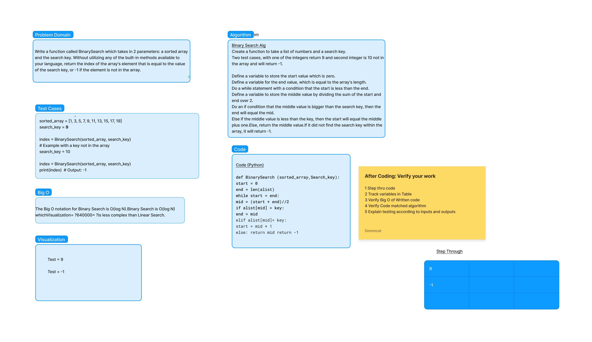

# README.md

## Array Binary Search

- Write a function called BinarySearch which takes in 2 parameters: a sorted array and the search key. Without utilizing any of the built-in methods available to your language, return the index of the array’s element that is equal to the value of the search key, or -1 if the element is not in the array.

## Whiteboard Process

## Approach & Efficiency

- The function BinarySearch takes in two parameters: arr is the sorted array, and key is the value that we want to find.
- We initialize left and right variables to keep track of the boundaries of the search range. We start with left as 0 and right as the index of the last element in the array.
- We enter a while loop that continues until left becomes greater than right. This means that we have searched the entire array without finding the element.
- Inside the loop, we calculate the midpoint index using integer division.
- We compare the value at the midpoint index with the search key. If they are equal, we have found the element, so we return the index.

## Solution

- [Challenge 3](array_binary_search.py)

- [Code Challenge 03 readme](https://github.com/jdutchfoy/data-structures-and-algorithms/blob/main/python/code_challenges/array-binary-search/README.md)
